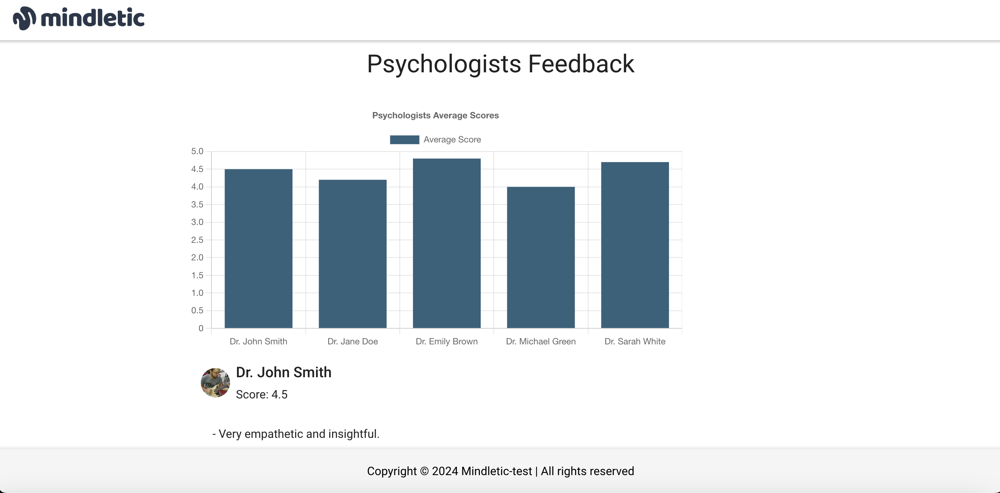

<!-- # Mindletic - Next.js App using Clean Architecture

Install it and run:

```bash
npm install
npm run dev
```

Open [http://localhost:3000](http://localhost:3000) with your browser to see the result.

### Concepts Used
## Clean Architecture
- Clean Architecture principles i have use here to help with thorough seperation of concern and make it loosely coupled to dependecies such as the front frontend frameworks, the client used.ie  (GRAPHQL, REST).

 -->

### Mindletic - Next.js App Using Clean Architecture

Mindletic is a Next.js application built with a focus on Clean Architecture principles. This architecture ensures a robust, maintainable, and scalable codebase by promoting a clear separation of concerns and decoupling from external dependencies such as REST or GraphQL clients.

## Table of Contents

```
    Demo
    Features
    Installation
    Usage
    Concepts Used
    Clean Architecture
    Separation of Concerns
    Decoupling from External Dependencies
    Project Structure
    Technologies Used
    Contributing
    License
    Demo
```

## Demo



## Features

Fixed Navigation Bar and Footer: Ensures consistent access to navigation and information.
Psychologist Scores Chart: Visual representation of psychologist performance.
Feedback Summary List: Detailed feedback for each psychologist.
Add New Psychologist: Allows users to dynamically add psychologists with feedback.
Responsive Design: Optimized for various screen sizes and devices.
Error Handling: Graceful handling of data fetching errors with retry mechanisms.
Installation
Clone the Repository

bash
Copy code
git clone https://github.com/your-username/mindletic.git
cd mindletic
Install Dependencies

Ensure you have Node.js installed.

```
Copy code
npm install
```

Run the Development Server

```
Copy code
npm run dev
```

Navigate to http://localhost:3000 to view the application.

## Usage

View Psychologist Scores: Access the chart to see the average scores of various psychologists.
Read Feedback: Scroll through the feedback summaries to gain insights into each psychologist's performance.
Add a New Psychologist: Use the form at the bottom of the page to add a new psychologist along with feedback.

## Concepts Used

# Clean Architecture

Clean Architecture is a software design philosophy that emphasizes a separation of concerns, making the system more maintainable, testable, and scalable. By adhering to Clean Architecture principles, Mindletic ensures that each part of the application has a single responsibility and that the system's core logic remains unaffected by external factors.

Key Principles Implemented:

Independence of Frameworks: The architecture does not depend on any particular technology or framework, allowing for flexibility in choosing or changing tools.
Testability: Business rules can be tested independently of external dependencies.
UI Agnostic: The user interface can be changed without affecting the business logic.
Separation of Concerns: Different aspects of the application are handled by distinct layers, reducing complexity and enhancing clarity.
Separation of Concerns
Each layer in the application has a distinct responsibility:

Domain Layer: Contains business logic and entity definitions.
Data Layer: Handles data fetching and storage, abstracting the data sources.
Presentation Layer: Manages the UI components and user interactions.
Core Layer: Includes foundational elements like base classes and utilities.
This separation ensures that changes in one part of the system have minimal impact on others, facilitating easier maintenance and scalability.

Decoupling from External Dependencies
Mindletic is designed to be decoupled from specific external dependencies such as REST or GraphQL clients. This is achieved by:

Abstracting Data Sources: Using repository interfaces that define data fetching methods without tying them to a specific client.

typescript
// Example: PsychologistRepository Interface

```
export interface IPsychologistRepository {
 getPsychologists: () => Promise<Psychologist[]>;
}
```

Implementing Concrete Repositories: Concrete classes implement these interfaces using chosen clients (e.g., REST or GraphQL), allowing easy swapping or modification without affecting other layers.

```
export class GraphQLPsychologistRepository implements IPsychologistRepository {
async getPsychologists(): Promise<Psychologist[]> {
// Implement GraphQL fetching logic here
}
}
```

Dependency Injection: The chosen repository implementation is injected into the necessary components, promoting flexibility and testability.

This decoupling ensures that the core business logic remains unaffected by changes in external data sources or communication protocols.

Project Structure

```bash
Copy code
/project-root
│
├── /app
│ ├── layout.tsx
│ └── page.tsx
│
├── /components
│ ├── Navbar.tsx
│ ├── Footer.tsx
│ ├── ChartComponent.tsx
│ ├── FeedbackList.tsx
│ └── AddPsychologist.tsx
│
├── /blocs
│ ├── PsychologistBloc.ts
│ ├── PsychologistState.ts
│ └── PsychologistPloc.ts
│
├── /context
│ └── PsychologistContext.tsx
│
├── /data
│ ├── /repositories
│ │ ├── PsychologistRepository.ts
│ │ └── GraphQLPsychologistRepository.ts
│ └── /api
│ └── mockGraphQL.ts
│
├── /domain
│ ├── /entities
│ │ └── Psychologist.ts
│ └── DataError.ts
│
├── /presentation
│ ├── /components
│ │ ├── Navbar.tsx
│ │ ├── Footer.tsx
│ │ ├── ChartComponent.tsx
│ │ ├── FeedbackList.tsx
│ │ └── AddPsychologist.tsx
│ └── /providers
│ └── psychologyProvider.tsx
│
├── /theme
│ └── index.ts
│
├── package.json
├── tsconfig.json
└── README.md
```

# Layer Descriptions:

- /app: Contains Next.js specific files like layout.tsx and page components.`
- /components: Reusable UI components used across the application.
- /blocs: Business Logic Components managing state and business rules.
- /context: React Contexts for providing global state and functionality.
- /data: Data layer handling data fetching, storage, and repository implementations.
- /domain: Core business logic and entity definitions.
- /presentation: UI-related components and providers.
- /theme: MUI theme configurations.

# Technologies Used

- Next.js: React framework for server-side rendering and generating static websites.
- React: JavaScript library for building user interfaces.
- Material-UI (MUI): React UI framework for implementing Google's Material Design.
- TypeScript: Typed superset of JavaScript for enhanced developer experience and code reliability.
- GraphQL/REST: API communication protocols (Abstracted via Clean Architecture).

# Why Clean Architecture?

Adopting Clean Architecture in the Mindletic project offers numerous benefits:

Maintainability: Clear separation of concerns makes the codebase easier to understand and modify. Developers can navigate and update specific parts without unintended side effects.

Testability: Business logic is isolated from external dependencies, allowing for straightforward unit and integration testing.

Scalability: The architecture supports growing the application with new features or layers without disrupting existing functionalities.

Flexibility: Decoupled components can be easily replaced or upgraded. For instance, switching from a REST client to a GraphQL client requires minimal changes confined to the data layer.

Reusability: Components and services are designed to be reusable across different parts of the application or even across different projects.

Dependency Injection: Injecting the desired repository implementation into the BLoC or services ensures that the core application logic remains agnostic of the data fetching mechanism.

Easy Switching of Data Sources: Whether using REST, GraphQL, or any other client, switching is seamless and confined to the data layer.

Enhanced Testability: Mock repositories can be easily created for testing purposes without relying on actual data sources.

Reduced Coupling: The core application logic doesn't depend on external libraries or frameworks, promoting a cleaner and more resilient codebase.

Conclusion
Mindletic Next App leverages Clean Architecture to deliver a robust, maintainable, and scalable Next.js application. By emphasizing a clear separation of concerns and decoupling from external dependencies, the project ensures that business logic remains at the core, free from the intricacies of data fetching or presentation layers. This architectural choice not only enhances the current application's quality but also sets a solid foundation for future growth and adaptability.
